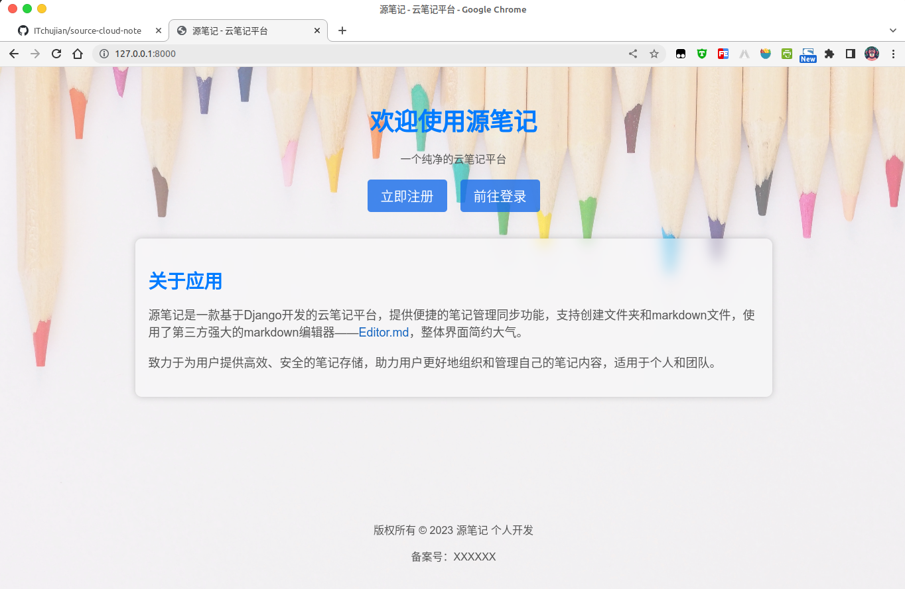
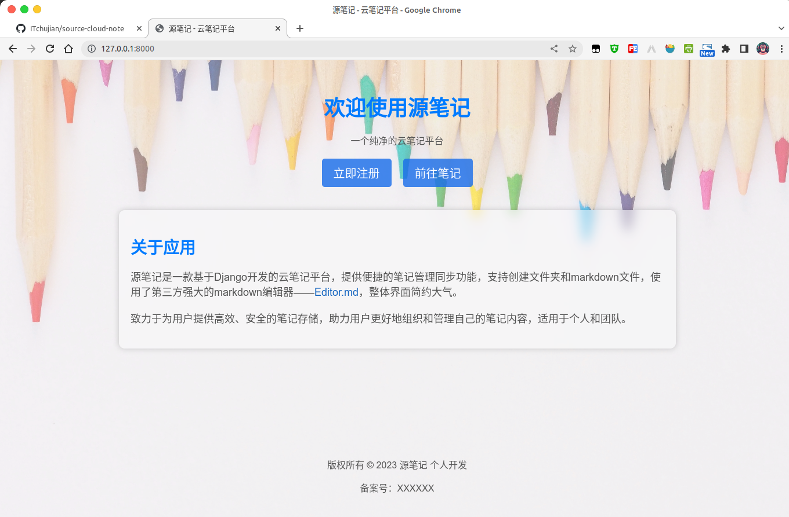
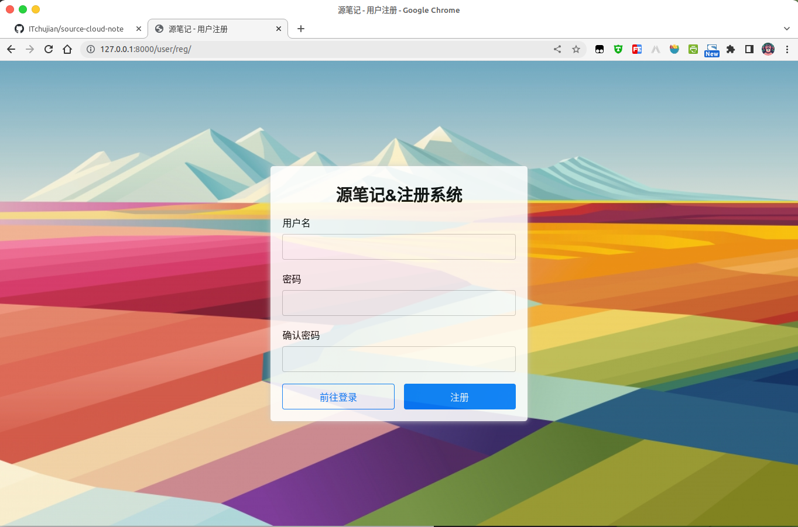
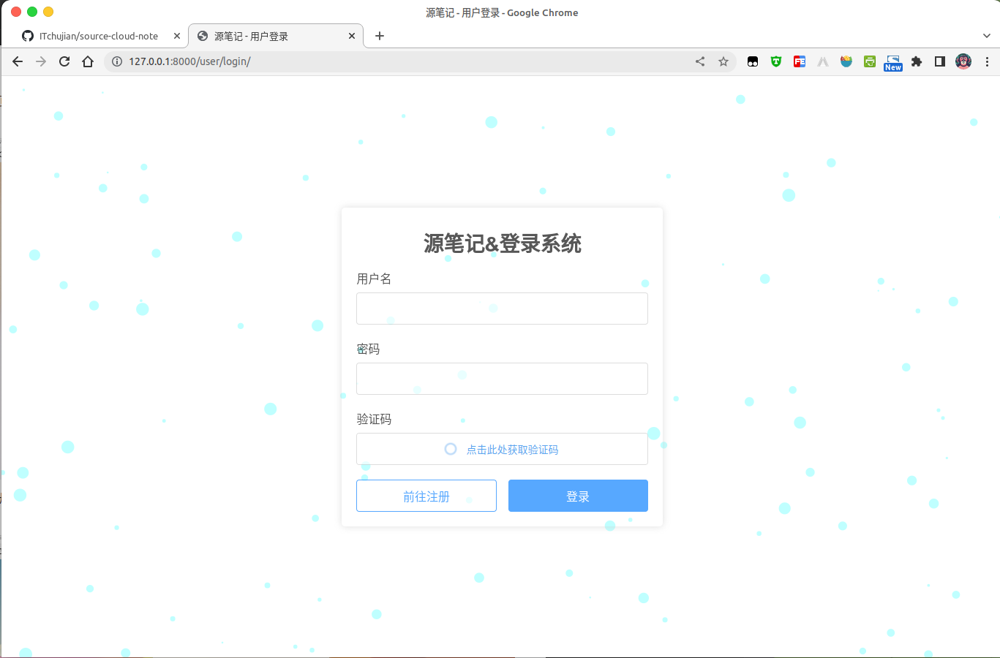
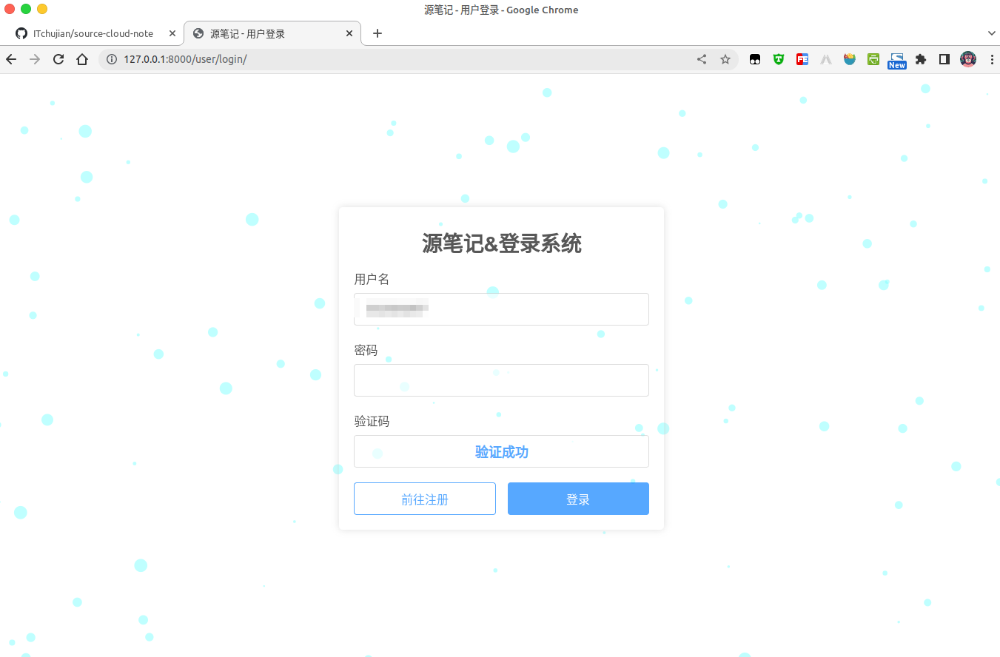
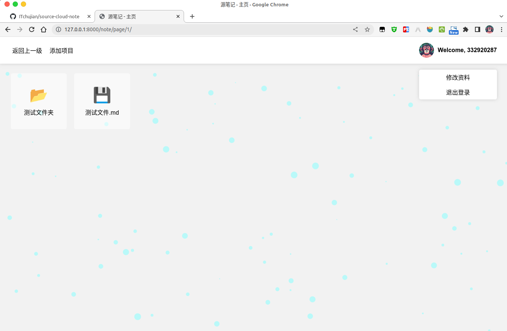
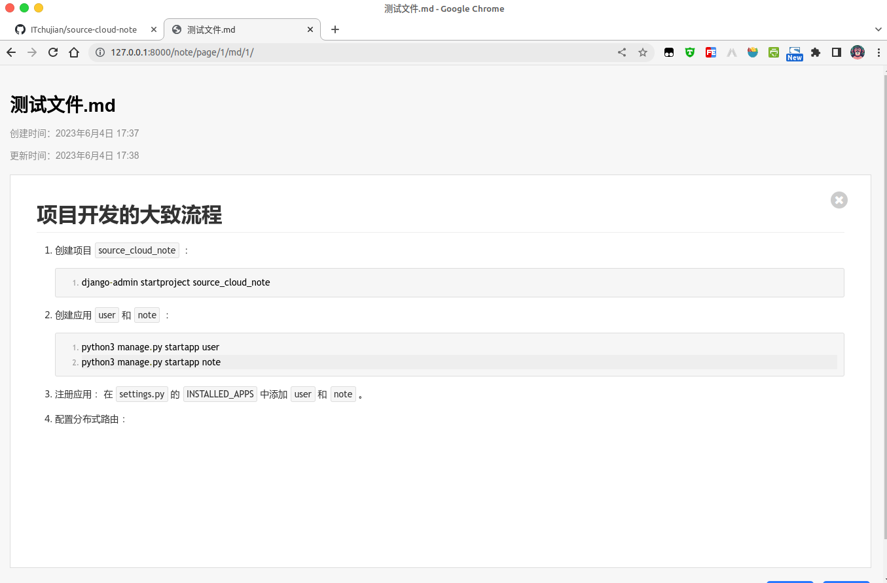
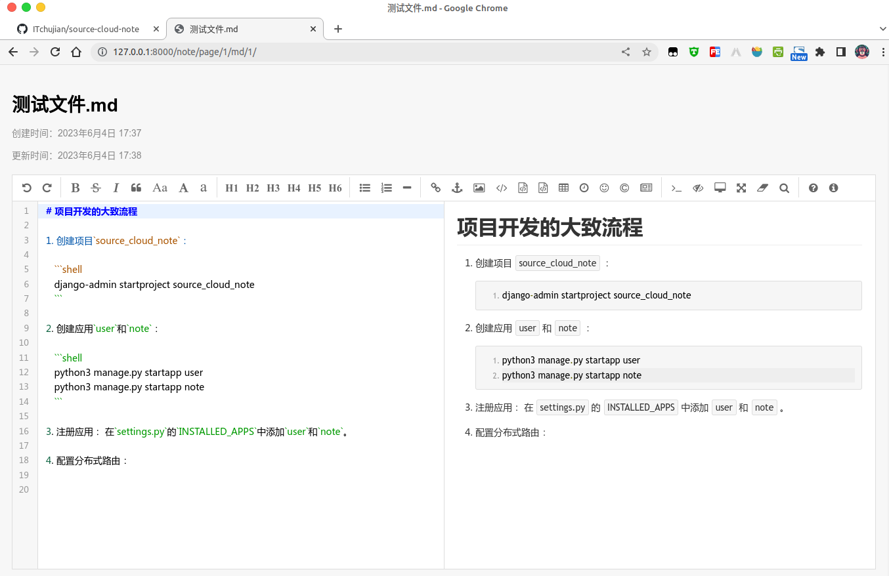

# 作者的话

学了Django框架的部分知识，在学习的过程中，看到老师教了这个项目，但是非常的简陋，于是自己重新弄，想开发得更好一点，忙于找工作的原因，这个项目就暂时停在这里了，唉，后端学的比前端好，对CSS真的很头大，所以页面做得很简陋，整个网站也很小白，见谅……

# 项目部署

## Debug=True

1. 修改`settings.py`中的数据库配置，连接MySQL数据库。

2. 迁移模型到数据库：

```shell
python3 manage.py makemigrations
python3 manage.py migrate
```

3. 运行项目：

```shell
python3 manage.py runserver
```

## Debug=False

1. 配置Web服务器以代理到Django应用程序。
2. 配置静态文件的访问。
3. 需要反复调试，保证网站正常运行。

# 源笔记界面

1. 主页





2. 注册页面



3. 登录页面






4. 笔记根目录



5. markdown笔记





# 项目开发大致流程

1. 创建项目`source_cloud_note`：

   ```shell
   django-admin startproject source_cloud_note
   ```

2. 创建应用`user`和`note`：

   ```shell
   python3 manage.py startapp user
   python3 manage.py startapp note
   ```

3. 注册应用： 在`settings.py`的`INSTALLED_APPS`中添加`user`和`note`。

4. 配置分布式路由：

   - 当用户访问 `http://127.0.0.1:8000/` 或者 `http://127.0.0.1:8000/home` 时，定义一个视图函数`home`返回。
   - 当用户访问以 `http://127.0.0.1:8000/user` 开头的功能时，使用`user/urls.py`继续进行功能的匹配。
   - 当用户访问以 `http://127.0.0.1:8000/note` 开头的功能时，使用`note/urls.py`继续进行功能的匹配。

5. 为`user`应用和`note`应用添加模型。

   - 在MySQL数据库中创建数据库`cloud_note`，设置编码为`utf8`

     ```mysql
     CREATE DATABASE `cloud_note` DEFAULT CHARACTER SET utf8mb4 COLLATE utf8mb4_unicode_ci;
     ```

   - 修改`settings.py`中的数据库配置，连接MySQL数据库：

     ```python
     'ENGINE': 'django.db.backends.mysql',
     'NAME': 'cloud_note',
     'USER': 'root',
     'PASSWORD': '',
     'HOST': '127.0.0.1',
     'PORT': 3306,
     ```

   - 将模型迁移到数据库：

     ```shell
     python3 manage.py makemigrations
     python3 manage.py migrate
     ```

6. 在`user`应用下的`urls.py`中声明`app_name`。

   - 当用户直接访问 `http://127.0.0.1:8000/user/reg` 时，定义一个视图函数`reg_view`处理请求。
   - 当用户直接访问 `http://127.0.0.1:8000/user/login` 时，定义一个视图函数`login_view`处理请求。
   - 当用户直接访问登录页面时，调用验证码 `http://127.0.0.1:8000/user/api/call_captcha`，定义一个视图函数`captcha_api`处理请求。
   - 当用户点击登录时，访问 `http://127.0.0.1:8000/user/api/login`，定义一个视图函数`login_api`处理请求。
   - 当用户点击退出时，访问 `http://127.0.0.1:8000/user/api/logout`，定义一个视图函数`logout_api`处理请求。
   - 配置模板目录：在`templates`下创建`user`目录保存所有和用户相关的模板。

7. 在`note`应用下的`urls.py`中声明`app_name`。

   - 当用户直接访问 `http://127.0.0.1:8000/note/page` 时，定义一个视图函数`redirect_home`处理请求，重定向到根目录笔记。
   - 当用户直接访问 `http://127.0.0.1:8000/note/page/<int:foler_id>` 时，定义一个视图函数`home_view`处理请求。
   - 当用户创建文件时，访问 `http://127.0.0.1:8000/note/api/create_note`，定义一个视图函数`create_note_api`处理请求。
   - 当用户创建文件夹时，访问 `http://127.0.0.1:8000/note/api/create_folder`，定义一个视图函数`create_folder_api`处理请求。
   - 当用户删除文件或者文件夹时，访问 `http://127.0.0.1:8000/note/api/delete`，定义一个视图函数`delete_api`处理请求。
   - 当用户重命名文件或者文件夹时，访问 `http://127.0.0.1:8000/note/api/rename`，定义一个视图函数`rename_api`处理请求。
   - 当用户修改笔记内容并保存时，访问 `http://127.0.0.1:8000/note/api/content/modify`，定义一个视图函数`modify_content_api`处理请求。

# 感谢

1. [Python](https://www.python.org/)
2. [Django](https://www.djangoproject.com/)
3. [jQuery](https://jquery.com/)
4. [Editor.md](https://github.com/pandao/editor.md)

